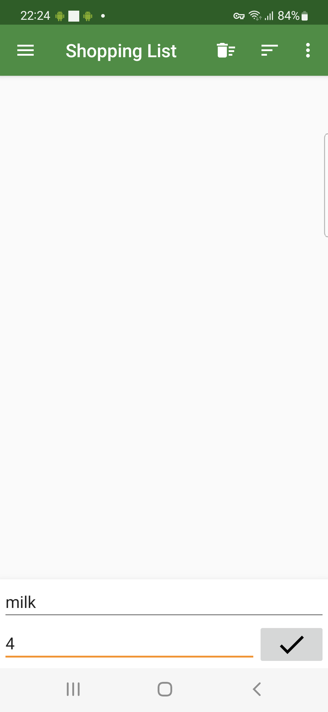

# 📱 Mobile Testing Project – Shopping List App

## 📌 Overview
This project demonstrates manual testing of an Android application using real devices in a cloud environment.

The objective is to simulate real-world QA activities, including test planning, test execution, bug reporting, and evidence collection.

---

## 🎯 Objective
Validate the functionality and input behavior of the following features:

- New Item field  
- Quantity field  
- Item creation flow  

---

## 🧪 Test Scope
The following types of testing were performed:

- Functional Testing  
- Exploratory Testing  
- Input Validation  
- Boundary Testing  

---

## ⚙️ Test Environment
Tests were executed under the following conditions:

- Platform: Android  
- OS Version: Android 11  
- Device: Samsung Galaxy S21  
- Execution: Real device cloud using BrowserStack  

---

## 🛠️ Tools Used
- BrowserStack (App Live)  
- Android real device (cloud)  

---

## 📁 Repository Structure

test-plan/ → test strategy and scope  
test-cases/ → detailed test scenarios  
bug-reports/ → identified issues  
evidence/ → screenshots from test execution  
device-info/ → device and environment details  

---

## 🔍 Key Findings
During testing, the following issues were identified:

- Missing feedback when required fields are invalid  
- Quantity field accepts non-numeric input  
- No validation for maximum input length  

---

## 🐞 Reported Issues

| ID     | Description                                 | Severity |
|--------|---------------------------------------------|----------|
| BUG-01 | No feedback on invalid input                | Medium   |
| BUG-02 | Quantity field accepts non-numeric values   | High     |
| BUG-03 | No input length validation                 | Medium   |

---

## 📸 Evidence
All test execution evidence is available in the `/evidence` folder.

Examples include:
- Valid item creation  
- Empty field validation  
- Invalid input handling  
- Boundary testing scenarios  
- Device execution logs  

### 🔍 Sample Evidence

in construction
---

## 🔗 References

- Test platform: BrowserStack (Real Device Cloud)  
- Tested application: Shopping List (Android)  
- F-Droid source: https://f-droid.org/pt_BR/packages/com.woefe.shoppinglist/  

---

## 📦 App Details

- Package: com.woefe.shoppinglist  
- Source: F-Droid  
- Type: Open-source Android application  

---

## 💡 Notes
Tests were executed in a real device cloud environment, simulating real user interaction.

This project focuses on demonstrating practical QA skills, including:

- Test design  
- Bug identification  
- Input validation analysis  
- Structured documentation  

---

## 👩‍💻 Author
- Marcia Regina Stankiwich
- QA Engineer – Mobile Testing Portfolio Project
